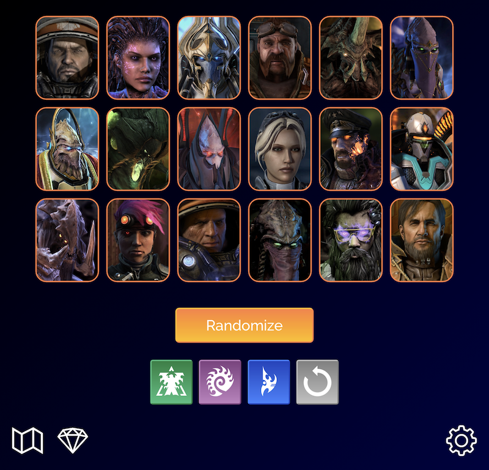

# starcraft2-coop-randomizer

A [randomizer for *Starcraft II* co-op mode](https://jcfieldsdev.github.io/starcraft2-coop-randomizer/). Written in JavaScript. It picks a random map and commander; unlike the game client, it allows certain maps and commanders to be excluded. It also randomizes prestige talents.

## Guide

### General

Click a commander portrait to enable or disable him or her and then press the "Randomize" button to select a random commander from the remaining set. The Terran, Zerg, and Protoss buttons toggle all commanders of the respective race, and the reset button enables all commanders.

The map icon in the bottom-left corner brings up the **Maps** menu. Maps can also be enabled or disabled by clicking on them. Maps are only randomized if at least one has been disabled.

The diamond icon brings up the **Prestiges** menu, which allows toggling prestige talents. Prestiges are only randomized for a commander if changed from the default values.

If playlist mode is enabled, the list icon brings up the **Playlist** menu, which shows which commanders and maps have already been played and which still remain for selection.

The corner of each menu has a close button that closes the overlay and a reset button that resets its selections to their default values.

### Options

The cog icon in the bottom-right corner brings up the **Options** menu, which has the following options:

- *Allow repeats*—Allows the same commander or map to be chosen twice in a row. The randomizer prevents this by default. Commander portraits appear with blue borders when this option is active.
- *Use playlist*—Selects commanders and maps from a randomized list, preventing any commander or map from being selected a second time until the entire list has been played. This option provides the most variety since it ensures that every option is selected equally frequently. Commander portraits appear with violet borders when this option is active.
- *Play sounds*—Toggles the commander lock-in sounds that play when the "Randomize" button is pressed.
- *Volume*—Adjusts the sound volume level. The default is 50%.

The corner of the menu has a close button that closes the overlay and a reset button that resets all options to their default values.

Note that the *Allow repeats* and *Use playlist* options are mutually exclusive and that enabling one disables the other.

### Hotkeys

#### General

| Key | Function |
| -- | -- |
| `Space` | Randomize |
| `T` | Toggle Terran commanders |
| `Z` | Toggle Zerg commanders |
| `P` | Toggle Protoss commanders |
| `F` | Research "A Strong Heart" |
| `M` | Toggles **Maps** menu |
| `G` | Toggles **Prestiges** menu |
| `L` | Toggles **Playlist** menu |
| `O` | Toggles **Options** menu |
| `Esc` | Reset commanders |

#### Options

| Key | Function |
| -- | -- |
| `Up` or `Down` | Adjust volume |
| `R` | Toggle repeats |
| `Q` | Toggle playlist |
| `S` | Toggle sounds |
| `D` | Reset options to defaults |

## Acknowledgments

Vectorized [Terran](https://www.deviantart.com/elrondsmith/art/Vector-Terran-Logo-267280000), [Zerg](https://www.deviantart.com/elrondsmith/art/Vector-Zerg-Logo-256676991), and [Protoss](https://www.deviantart.com/elrondsmith/art/Vector-Protoss-Logo-267281608) icons by [elrondsmith](https://www.deviantart.com/elrondsmith).

Uses [Raleway](https://github.com/impallari/Raleway) font by [Matt McInerney](https://blog.matt.cc/) and contributors.

## Authors

- J.C. Fields <jcfields@jcfields.dev>

## License

- [MIT license](https://opensource.org/licenses/mit-license.php)

## See also

- [*Starcraft II* Hotkey Editor](https://github.com/jcfieldsdev/starcraft2-hotkey-editor)—A hotkey editor that includes all of the co-op mode units.
- [*Starcraft II* Co-op Replay Tool](https://github.com/jcfieldsdev/starcraft2-coop-replay-tool)—A utility for analyzing co-op replays.
